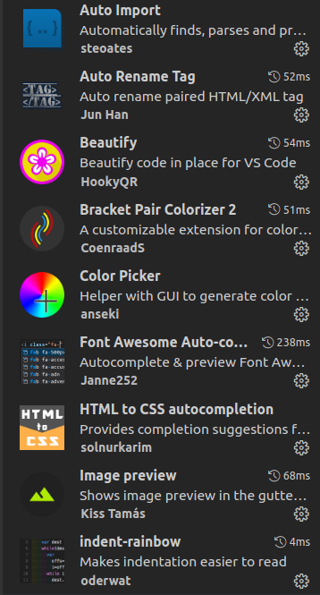
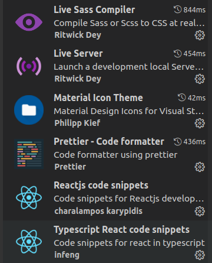

# 
 Outils de développement utilisés pour le projet 

## Visual Studio Code

C'est l'un des éditeurs de codes le plus populaire, totalement open source et gratuit. Il est très stable et dispose de nombreuses extensions pour aider les développeurs.

## Plugins utilisés

 

